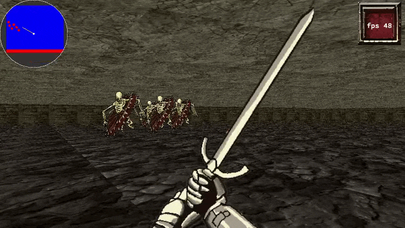
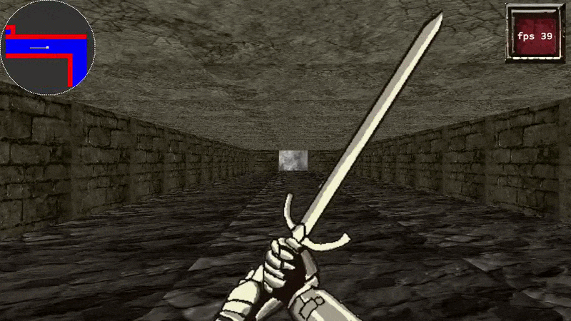

# hollow3d

A **Dark Souls–themed raycasting engine**, built from scratch in C as the `cub3d` project for 42. It renders a first‑person, textured 3D view of a 2D map in real time — no external 3D engine, just raycasting math, custom parsing, and [MLX42](https://github.com/codam-coding-college/MLX42) for the window/graphics layer.

The mandatory version is a classic raycaster: textured walls and WASD + arrow-key controls. The bonus version turns it into an actual mini dungeon crawler: animated doors, a minimap, wandering enemies, an FPS counter, and a swingable sword.

## Technical overview

- **Language:** C, compiled with `gcc` (`-O3 -flto -ffast-math`, AddressSanitizer enabled)
- **Rendering:** custom DDA raycasting engine (wall projection, textured hits, floor/ceiling casting in the bonus version)
- **Graphics library:** [MLX42](https://github.com/codam-coding-college/MLX42) (built with CMake), a modern replacement for the classic 42 MiniLibX, using GLFW under the hood
- **Own libraries:** `libft` (custom C standard-library replacement) is vendored under `libraries/libft`
- **Map format:** custom `.cub` map files — ASCII grids describing walls, floor/ceiling colors, wall textures, spawn point, and (bonus only) doors and enemies
- **Window:** 960×540 by default
- **Bonus additions on top of the mandatory raycaster:**
  - Animated opening/closing doors
  - A radar-style minimap
  - Roaming enemies with sprite rendering and depth sorting
  - Live FPS counter overlay
  - A first-person sword swing animation

## Project structure

```
hollow3d/
├── sources/            # mandatory raycaster source
├── sources_bonus/      # bonus source (doors, enemies, minimap, FPS, sword)
├── libraries/
│   ├── MLX42/          # graphics library (built via CMake)
│   └── libft/          # custom C library
├── maps/                # .cub map files
├── resources/            # textures, sprites, UI assets
├── cub3d.h               # shared header
└── Makefile
```

## How to compile

**Requirements:** Linux (or macOS) with `gcc`, `make`, `cmake`, and `glfw` installed, since MLX42 is built from source as part of the build.

```bash
git clone https://github.com/regalfelix/hollow3d.git
cd hollow3d
```

Build the **mandatory** version:

```bash
make
```

Build the **bonus** version:

```bash
make bonus
```

Both targets build `libft` and `MLX42` automatically before linking the final `cub3d` binary. Switching between `make` and `make bonus` re-links automatically (each target clears the other's link marker), but a full rebuild is always safe:

```bash
make clean    # remove object files and build/ dir, keep the binary
make fclean   # also remove the cub3d binary
make re       # fclean + all (mandatory)
```

## How to execute

Run the binary with a `.cub` map file as the only argument:

```bash
./cub3d maps/<map_name>
```

Maps live in `maps/`. Point the binary at any valid `.cub` file to start playing

## Controls

### Mandatory version

| Key | Action |
|---|---|
| `W` / `A` / `S` / `D` | Move forward / left / back / right |
| `←` / `→` | Rotate camera |
| `Esc` | Quit |

### Bonus version

| Key | Action |
|---|---|
| `W` / `A` / `S` / `D` | Move forward / left / back / right |
| `←` / `→` | Rotate camera |
| `↑` | Swing sword |
| `Esc` | Quit |

Doors open automatically as you approach them, and the minimap and FPS counter are always shown on-screen.

## Screenshots & video

```markdown

```

```markdown
## Gameplay demo for bonus




https://github.com/user-attachments/assets/your-uploaded-video-id
```
